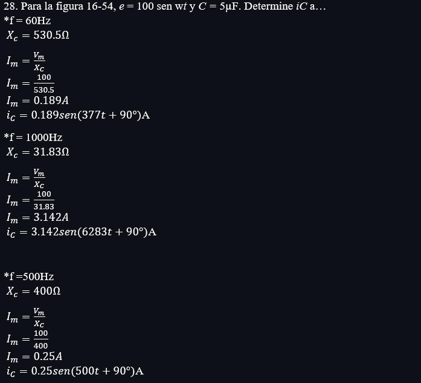

# InformeTarea8

☻ Objetivos Generales:

* Se aspira que al finalizar el deber que se adquiera y comprenda conocimientos de CA, Elementos R, L y C

* Adicionalmente se debe ser capaz de establecer las relaciones o interconexiones correspondientes entre los fundamentos teóricos establecidos en el curso y las aplicaciones en sus respectivas disciplinas.

☻ Objetivos Específicos:
* Introducir los concepto de CA, Elementos R, L y C
* Analizar circuitos donde se use voltaje y corriente CA
* Describir analítica y gráficamente el comportamiento de un circuito CA

2. Marco Teorico 

3. EXPLICACIÓN Y RESOLUCIÓN DE EJERCICIOS PROBLEMAS

Capitulo 15

Cap 16

4. VDEO:

5. CONCLUSIONES

El trabajo realizado para la resolución del deber ha sido muy provechosa por varias razones, las cuales se resumen en esta conclusión. En primer lugar, se ha practicado sobre los conceptos de Frecuencia, periodo, amplitud y valor pico, ademas una introduccion a los fasores, asi mismo los elementos R, L y C y el concepto de impedancia.

También se pudo ampliar el concepto analisis por computadora estableciendo relaciones entre estos valores en base a los ejercicios con los que se están trabajando en este deber. Un aprendizaje muy valioso que se obtuvo de este trabajo es que se tiene la forma en que se aplicaron los conceptos y propiedades que nos brindó el libro de Análisis de Circuitos de los capítulos 15 y 16 que fueron comprobadas, por medio de la resolución de los ejercicios. Se ha cumplido con los objetivos propuestos para este trabajo, y se desea que este reporte sea de provecho para aquellos que próximamente aplique sus conceptos.

6. BIBLIOGRAFÍA

Allan.H.Wilhelm.C.(2008). Análisis de circuitos teoría y práctica. Santa Fe, México: Cengage learning editores.
